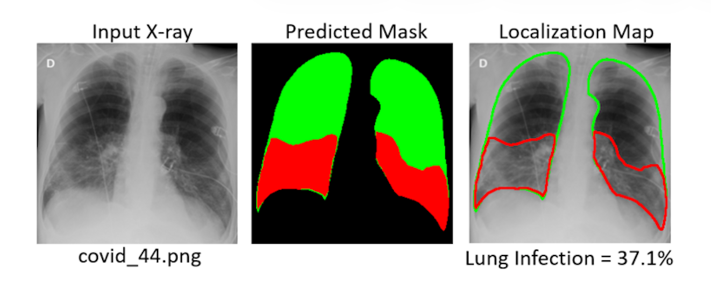

# 基于动态聚焦搜索的医疗影像细粒度识别

## 数据集

**COVID-QU-Ex Dataset**

https://www.kaggle.com/datasets/anasmohammedtahir/covidqu

> The researchers of Qatar University have compiled the COVID-QU-Ex dataset, which consists of 33,920 chest X-ray (CXR) images including:
>
> - 11,956 COVID-19 11,956
> - 11,263 Non-COVID infections (Viral or Bacterial Pneumonia)
> - 10,701 Normal 10,701
>   Ground-truth lung segmentation masks are provided for the entire dataset. This is the largest ever created lung mask dataset. 

