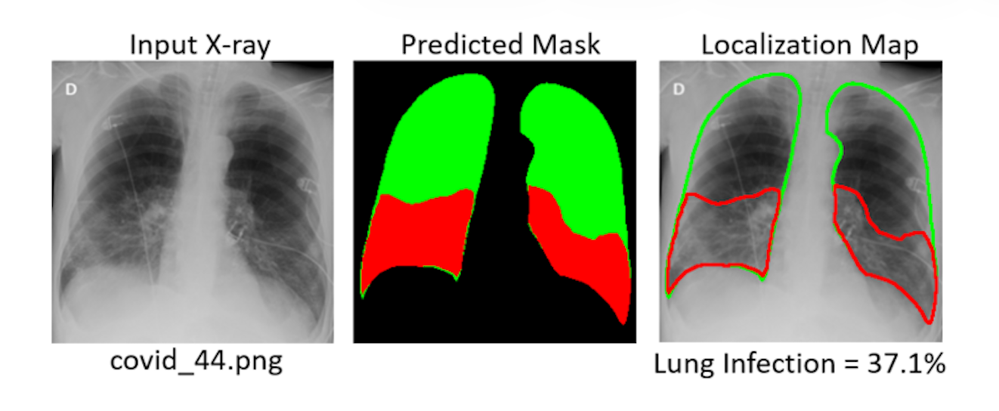

# 基于动态聚焦搜索的医疗影像细粒度识别
## 项目介绍

本项目基于动态聚焦搜索（Dynamic Focus Search）算法，实现了对医疗影像的细粒度识别。模拟了人眼的聚焦搜索过程，通过动态调整搜索范围和步长，实现了对目标的高效识别。

This project implements a fine-grained image recognition system for medical images using the Dynamic Focus Search (DFS) algorithm. The DFS algorithm simulates the focusing process of the human eye, dynamically adjusting the search range and step size to efficiently identify the target.

## 数据集

**COVID-QU-Ex Dataset**

https://www.kaggle.com/datasets/anasmohammedtahir/covidqu

> The researchers of Qatar University have compiled the COVID-QU-Ex dataset, which consists of 33,920 chest X-ray (CXR) images including:
>
> - 11,956 COVID-19 11,956
> - 11,263 Non-COVID infections (Viral or Bacterial Pneumonia)
> - 10,701 Normal 10,701
>   Ground-truth lung segmentation masks are provided for the entire dataset. This is the largest ever created lung mask dataset. 



## 环境配置

### 快速配置指南


1. **创建虚拟环境（推荐）**
   ```bash
   # 使用conda创建虚拟环境
   conda create -n dfs-medical python=3.11
   conda activate dfs-medical
   
   # 或使用venv创建虚拟环境
   python3 -m venv venv
   # Windows: venv\Scripts\activate
   # macOS/Linux: source venv/bin/activate
   ```

2. **安装依赖**
   ```bash
   pip install -r requirements.txt
   ```

3. **验证安装**
   ```bash
   python -c "import torch; print('PyTorch version:', torch.__version__)"
   python -c "import cv2; print('OpenCV version:', cv2.__version__)"
   ```


### 硬件要求

- **CPU**：至少4核处理器
- **内存**：至少8GB RAM
- **GPU**（推荐）：支持CUDA的GPU，至少4GB显存
- **存储**：至少10GB可用空间（用于数据集和模型）

## 项目结构

```
基于动态聚焦搜索的医疗影像细粒度识别/
├── dataset.py               
├── dynamic_focus_net.py     
├── train_dynamic_focus.py   
├── baseline/                
│   ├── train_baseline.py    
│   └── visualize_cam.py     
├── ablation/                
│   ├── baseline_resnet.py          
│   ├── channel_attention_net.py    
│   ├── hybrid_attention_net.py     
│   ├── train_ablation.py           
│   └── README.md                   
├── README.md               
├── requirements.txt        
└── dataset/                
    ├── Train/              
    │   ├── COVID-19/
    │   │   ├── images/
    │   │   ├── lung masks/
    │   │   └── infection masks/
    │   ├── Non-COVID/
    │   │   ├── images/
    │   │   ├── lung masks/
    │   │   └── infection masks/
    │   └── Normal/
    │       ├── images/
    │       ├── lung masks/
    │       └── infection masks/
    ├── Val/                
    │   ├── COVID-19/
    │   ├── Non-COVID/
    │   └── Normal/
    └── Test/               
        ├── COVID-19/
        ├── Non-COVID/
        └── Normal/
```